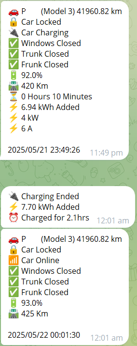

# teslamate-tgbot

This is a TESLAMATE complement (addon) that sends updates to a Telegram chat. It reads a MQTT broker for messages about TESLA car and sends correlated informations via a Telegram bot to it's owner.

<p align="center">
  
</p>

Environnement variables :

```
      - MQTT_BROKER_HOST=mosquitto_IP                  # IP or FQDN 
      - MQTT_BROKER_PORT=mosquitto_PORT                # (optional) default 1883
      - MQTT_BROKER_USERNAME=username                  # (optional)
      - MQTT_BROKER_PASSWORD=password                  # (optional)
      - TELEGRAM_BOT_API_KEY=xxxxxxxxxxxxxxxxxxxxxxx   # See Telegram doc https://core.telegram.org/
      - TELEGRAM_BOT_CHAT_ID=xxxxxxxxxxxxxx            # See Telegram doc https://core.telegram.org/
      - TZ=                                            # Timezone
      - CAR_ID=1                                       # (optional) Your "n"th car in your Tesla's inventory
      - TIMESTAMP=bottom                               # (optional) prints the date at the [bottom|top|none] of each message, none won't prints it
      - UNITS=Km                                       # (optional) Metric or Imperial measurement display [Km|Miles] 
      - DEBUG=True                                     # (optional) Display on console the bot messages / default is false
```

Example of a docker-compose for the full suite of Teslamate containers including this Telegram bot :

```
services:
  teslamate:
    image: teslamate/teslamate:latest
    restart: always
    environment:
      - ENCRYPTION_KEY=secretkey #replace with a secure key to encrypt your Tesla API tokens
      - DATABASE_USER=teslamate
      - DATABASE_PASS=password #insert your secure database password!
      - DATABASE_NAME=teslamate
      - DATABASE_HOST=database
      - MQTT_HOST=mosquitto
    ports:
      - 4000:4000
    volumes:
      - ./import:/opt/app/import
    cap_drop:
      - all

  database:
    image: postgres:17
    restart: always
    environment:
      - POSTGRES_USER=teslamate
      - POSTGRES_PASSWORD=password #insert your secure database password!
      - POSTGRES_DB=teslamate
    volumes:
      - teslamate-db:/var/lib/postgresql/data

  grafana:
    image: teslamate/grafana:latest
    restart: always
    environment:
      - DATABASE_USER=teslamate
      - DATABASE_PASS=password #insert your secure database password!
      - DATABASE_NAME=teslamate
      - DATABASE_HOST=database
    ports:
      - 3000:3000
    volumes:
      - teslamate-grafana-data:/var/lib/grafana

  mosquitto:
    image: eclipse-mosquitto:2
    restart: always
    command: mosquitto -c /mosquitto-no-auth.conf
    # ports:
    #   - 1883:1883
    volumes:
      - mosquitto-conf:/mosquitto/config
      - mosquitto-data:/mosquitto/data
      
  telegrambot:
    image: keithchan1/tgbot:latest
    restart: always
    environment:
      - MQTT_BROKER_HOST=mosquitto_IP                  # IP or FQDN 
      - MQTT_BROKER_PORT=mosquitto_PORT                # (optional) default 1883
      - MQTT_BROKER_USERNAME=username                  # (optional)
      - MQTT_BROKER_PASSWORD=password                  # (optional)
      - TELEGRAM_BOT_API_KEY=xxxxxxxxxxxxxxxxxxxxxxx   # See Telegram doc https://core.telegram.org/
      - TELEGRAM_BOT_CHAT_ID=xxxxxxxxxxxxxx            # See Telegram doc https://core.telegram.org/
      - TZ=                                            # Timezone
      - CAR_ID=1                                       # (optional) Your "n"th car in your Tesla's inventory
      - TIMESTAMP=bottom                               # (optional) prints the date at the [bottom|top|none] of each message, none won't prints it
      - UNITS=Km                                       # (optional) Metric or Imperial measurement display [Km|Miles] 
      - DEBUG=True                                     # (optional) Display on console the bot messages / default is false

volumes:
  teslamate-db:
  teslamate-grafana-data:
  mosquitto-conf:
  mosquitto-data:

```

\*\*\* Licence : \*\*\*

All is free software under GPL licence.

Inspired and edited from:
https://github.com/gouroufr/teslamate-telegram
